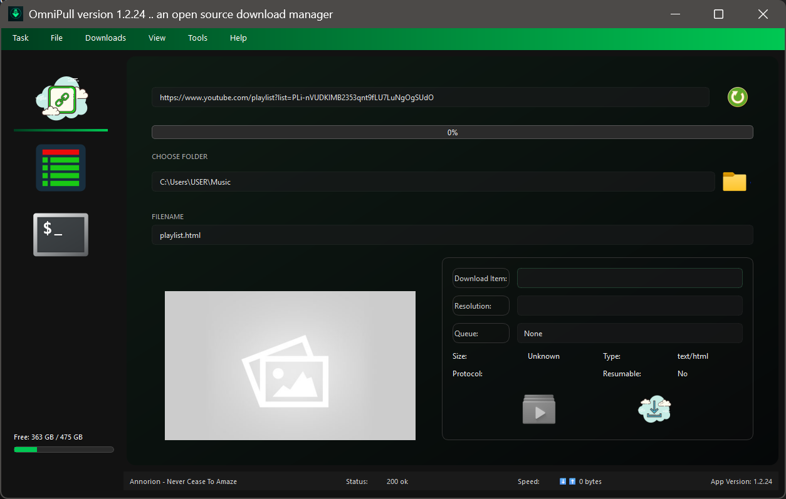

# OmniPull Download Manager

<p align="center">
    
</p>

<div align="center">
    
    [](LICENSE)
    [](https://python.org)
    [](https://wiki.qt.io/Qt_for_Python)
    
</div>

OmniPull is a powerful, cross-platform download manager built with Python and PySide6. It provides a modern, intuitive interface for managing downloads with advanced features like multi-threading, queue management, and media extraction.

<p align="center">
    
</p>

## 🚀 Key Feature

### Core Functionality
- **Multi-threaded Downloads**: Accelerate downloads with parallel processing
- **Pause/Resume Support**: Continue downloads from where they left off
- **Queue Management**: Organize and prioritize downloads
- **Scheduling System**: Set specific times for downloads to start
- **Browser Integration**: Direct download capture from browsers

### Media Features
- **YouTube Integration**: Download videos and playlists via yt-dlp
- **Streaming Support**: Handle various streaming protocols (HLS, DASH)
- **Audio Extraction**: Extract audio from video content
- **Format Selection**: Choose from multiple quality options

### User Experience
- **Modern UI**: Clean, intuitive interface with dark theme
- **Progress Monitoring**: Real-time download statistics
- **Download Windows**: Detailed progress for each download
- **Clipboard Monitoring**: Auto-detect URLs from clipboard
- **Multiple Language Support**: Internationalization ready

<p align="center">
    
    
</p>

## 🛠️ Technical Features

### Download Engines
- **Aria2c Integration**: High-performance download engine
- **Native Downloader**: Built-in download capabilities
- **yt-dlp Support**: Advanced media extraction

### Performance
- **Segmented Downloads**: Split large files for faster downloading
- **Smart Queuing**: Efficient download queue management
- **Resource Management**: Optimize system resource usage

### File Management
- **Checksum Verification**: Ensure file integrity
- **Auto-Resume**: Recover from interrupted downloads
- **File Organization**: Customizable download locations

## 📦 Installation

```bash
# Clone the repository
git clone https://github.com/yourusername/omnipull.git

# Navigate to the project directory
cd omnipull

# Install dependencies
pip install -r requirements.txt

# Run the application
python main.py
```

## 🌐 Browser Integration
OmniPull integrates with major browsers through extensions:
- Chrome/Edge
- Firefox
- Opera

## 🎯 Upcoming Features
- [ ] Cloud storage integration
- [ ] Advanced download scheduling
- [ ] Browser extension improvements
- [ ] More language support
- [ ] Enhanced media processing

## 🤝 Contributing
Contributions are welcome! Please follow these steps:

1. Fork the repository
2. Create your feature branch (`git checkout -b feature/AmazingFeature`)
3. Commit your changes (`git commit -m 'Add some AmazingFeature'`)
4. Push to the branch (`git push origin feature/AmazingFeature`)
5. Open a Pull Request

## 📄 License
This project is licensed under the MIT License - see the [LICENSE](LICENSE) file for details.

## 👨‍💻 Author
Emmanuel Gyimah Annor

## 🙏 Acknowledgments
- PySide6 team for the amazing GUI framework
- aria2c developers for the download engine
- yt-dlp team for YouTube integration
- All contributors and users of OmniPull

<p align="center">Made with ❤️ by Emmanuel Gyimah Annor</p>
