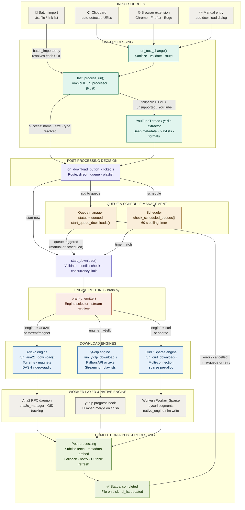

<!-- MANPAGE: BEGIN EXCLUDED SECTION -->
<div align="center">

<a href="#readme">
  
</a>


<br>[](#installation)
[](LICENSE)
[](https://github.com/Annor-Gyimah/OmniPull/releases)
[](https://github.com/Annor-Gyimah/OmniPull/stargazers)

[](https://github.com/Annor-Gyimah/OmniPull/commits)

</div>
<!-- MANPAGE: END EXCLUDED SECTION -->

OmniPull is a powerful, cross-platform download manager built with Python and PySide6. It provides a modern, intuitive interface for managing downloads with advanced features like multi-threading, queue management, scheduling, browser integration, and media extraction from popular video platforms.

<!-- MANPAGE: MOVE "USAGE AND OPTIONS" SECTION HERE -->

<!-- MANPAGE: BEGIN EXCLUDED SECTION -->
* [INSTALLATION](#installation)
    * [Windows](#windows)
    * [Linux](#linux)
    * [macOS](#macos)
    * [Building from Source](#building-from-source)
* [FEATURES](#features)
    * [Core Download Management](#core-download-management)
    * [Media & Streaming](#media--streaming)
    * [Browser Integration](#browser-integration)
    * [User Experience](#user-experience)
    * [Advanced Features](#advanced-features)
* [SUPPORTED PLATFORMS](#supported-platforms)
* [SUPPORTED PROTOCOLS](#supported-protocols)
* [USAGE](#usage)
    * [Basic Download](#basic-download)
    * [YouTube Download](#youtube-download)
    * [Queue Management](#queue-management)
    * [Browser Integration](#browser-integration-1)
*  [TRANSLATIONS](#translations)
* [CONFIGURATION](#configuration)
    * [Settings Location](#settings-location)
    * [Key Settings](#key-settings)
* [TECHNICAL DETAILS](#technical-details)
    * [Download Engines](#download-engines)
    * [Architecture](#architecture)
* [CONTRIBUTING](#contributing)
* [REPORTING ISSUES](#reporting-issues)
* [CHANGELOG](#changelog)
* [LICENSE](#license)
* [ACKNOWLEDGMENTS](#acknowledgments)
* [SUPPORT](#support)
<!-- MANPAGE: END EXCLUDED SECTION -->

# INSTALLATION

<!-- MANPAGE: BEGIN EXCLUDED SECTION -->
[](#windows)
[](#linux)
[](#macos)
[](#building-from-source)
[](https://github.com/Annor-Gyimah/OmniPull/releases)
<!-- MANPAGE: END EXCLUDED SECTION -->

You can download OmniPull for Windows, Linux, or macOS from the [Releases](https://github.com/Annor-Gyimah/OmniPull/releases) page.

---

### Windows

Download the latest OmniPull from the [Releases](https://github.com/Annor-Gyimah/OmniPull/releases) page.

**Recommended: Direct Download Links**
| File | Description |
|:---|:---|
| [OmniPull-Setup.exe](https://github.com/Annor-Gyimah/OmniPull/releases/latest/download/OmniPull-Setup.exe) | ✅ Full installer (includes ffmpeg, aria2c, yt-dlp) (Recommended) |
| [OmniPull-Setup-lite.exe](https://github.com/Annor-Gyimah/OmniPull/releases/latest/download/OmniPull-Setup-lite.exe) | ⚡ Smaller installer (requires external dependencies) |
| [OmniPull-Portable.exe](https://github.com/Annor-Gyimah/OmniPull/releases/latest/download/OmniPull-Portable.exe) | 🧳 Portable version (no install, minimal setup) |

> 💡 The full installer is recommended for most users.  
> It includes all required tools (`aria2c`, `ffmpeg`, `yt-dlp`) and works out of the box.  
> After installation, launch OmniPull from the Start Menu or desktop shortcut.
>
> The lite and portable versions require you to install some of these dependencies manually through the app.


---

### Linux

| File | Description |
|:---|:---|
| [OmniPull.AppImage](https://github.com/Annor-Gyimah/OmniPull/releases/latest/download/OmniPull.AppImage) | ✅ Portable (recommended) |
| [OmniPull.deb](https://github.com/Annor-Gyimah/OmniPull/releases/latest/download/OmniPull.deb) | 📦 Debian/Ubuntu package |


```bash
# AppImage
wget https://github.com/Annor-Gyimah/OmniPull/releases/latest/download/OmniPull.AppImage
chmod +x OmniPull.AppImage
./OmniPull.AppImage

# DEB
wget https://github.com/Annor-Gyimah/OmniPull/releases/latest/download/OmniPull.deb
sudo apt install ./OmniPull.deb or
sudo dpkg -i OmniPull.deb
sudo apt-get install -f  # Fix any missing dependencies
```

---

### macOS

> ⚠️ Pre-built macOS binaries are not yet available.
> You can run OmniPull using Python or install via PyPI.

---

### 🛠️ Install via PyPI (Recommended)

```bash
pip install omnipull
omnipull
```

---

> 💡 Requires: ffmpeg, yt-dlp, deno, aria2c
<br>
> Install with:
<br>
```bash
brew install ffmpeg yt-dlp deno
```

---

### Building from Source

```bash
# Clone the repository
git clone https://github.com/Annor-Gyimah/OmniPull.git
cd OmniPull

# Create virtual environment (recommended)
python -m venv venv
source venv/bin/activate  # Linux/macOS
# or: venv\Scripts\activate  # Windows

# Install dependencies
pip install -r requirements.txt

# Run the application
python main.py
```

**Requirements:**
- Python 3.10+
- PySide6
- yt-dlp
- aria2c 
- ffmpeg
- [OmniPull URL Processor](https://github.com/Annor-Gyimah/omnipull-url-processor)
- Notifypy (Works mostly for Windows)
- Plyer (Works well for both Windows and Linux)
---

# FEATURES

## Core Download Management

- **Multi-threaded Downloads**: Accelerate downloads with parallel connections (up to 16 segments)
- **Pause/Resume Support**: Continue downloads from where they left off after interruptions
- **Queue Management**: Organize, prioritize, and manage multiple download batches
- **Batch Downloads**: Import multiple URLs from files or clipboard
- **Scheduling System**: Set specific times for downloads to start automatically
- **Category Organization**: Organize downloads into custom categories

## Media & Streaming

- **YouTube Integration**: Download videos, playlists, and channels via yt-dlp
- **Platform Support**: Downloads from 1700+ websites including YouTube, Vimeo, TikTok, Instagram, and more
- **Streaming Protocols**: Full support for HLS, DASH, and HTTP streaming
- **Audio Extraction**: Extract audio from video content in MP3, AAC, FLAC, and other formats
- **Quality Selection**: Choose from multiple quality options (1080p, 4K, best available, etc.)
- **Subtitle Download**: Auto-fetch subtitles in multiple languages
- **Thumbnail Embedding**: Embed video thumbnails into downloaded files

## Browser Integration

- **Chrome/Edge Extension**: Capture downloads directly from Chrome-based browsers
- **Firefox Extension**: Native Firefox support
- **Clipboard Monitoring**: Auto-detect and add URLs copied to clipboard

## User Experience

- **Modern Dark UI**: Clean, intuitive PySide6 interface with dark theme
- **System Tray**: Background operation with tray icon
- **Progress Monitoring**: Real-time download statistics with speed graphs
- **Download Windows**: Detailed progress for each active download
- **Internationalization**: Ready for multiple language translations

## Advanced Features

- **Checksum Verification**: MD5, SHA-256 integrity checks
- **Auto-Retry**: Automatic resume on connection failures
- **Custom Headers**: Support for custom HTTP headers
- **Cookie Import**: Import authentication cookies from browsers
- **Proxy Support**: HTTP, HTTPS, SOCKS4, and SOCKS5 proxy support
- **User Agent**: Customizable user agents
- **Speed Limiting**: Throttle download speeds
- **Plugin System**: A marketplace to install plugins for advancing OmniPull's capabilities beyond being just a downloader. [See how to make OmniPull's Plugins](PLUGINS.md)

---

## Screenshots

| ![Main Window][01] | ![Downloads Queue][02] | ![Settings][03] |
|:---:|:---:|:---:|
| Main Window | Downloads Queue | Settings |
| ![Add Download][04] | ![Queue Manager][05] | ![Terminal][06] |
| Light Mode | Queue Manager | Terminal |

---

<!-- Image Links -->
[//]: # (Screenshot Links)
[01]: Screenshots/Mainwindow_&_add_download.png
[02]: Screenshots/Queues.png
[03]: Screenshots/Settings.png
[04]: Screenshots/Table_context_&_Light_mode.png
[05]: Screenshots/Queues.png
[06]: Screenshots/Terminal.png

---

OmniPull runs on:
- **Windows 10/11** (64-bit) - Primary platform with installer
- **Linux** - AppImage and DEB packages
- **macOS** - DMG packages (Intel and Apple Silicon)

---

# SUPPORTED PROTOCOLS

- HTTP, HTTPS, FTP, FTPS
- HTTP Range requests for resumed downloads
- MPEG-DASH streaming
- Apple HLS streaming
- Adobe HDS streaming
- RTMP/RTMPT streaming
- BitTorrent (via external tools)

---

# USAGE

## Basic Download

1. Click "Add Download" or paste a URL
2. Configure download options (location, threads, etc.)
3. Click "Start" to begin downloading

## YouTube Download

1. Paste a YouTube/video URL
2. Select quality and format
3. Click "Download"

## Queue Management

1. Create a new queue via "Queue" → "New Queue"
2. Add downloads to the queue
3. Configure scheduling options
4. Start the queue

## Browser Integration

1. Install the browser extension (Chrome/Firefox)
2. Configure the listening port in OmniPull settings
3. Downloads from the browser will automatically be captured

---

# TRANSLATIONS

OmniPull supports multiple languages using an automated translation workflow.

**Generate translations:**

```bash
python auto_translate.py
```

This will scan source files for translatable strings, automatically translate missing entries, and compile translation files.

**Improve translations:**

- **Open an issue**: Report incorrect translations with the "documentation" or "translation" label
- **Submit a PR**: Edit the `.ts` files directly and submit corrections

---

# CONFIGURATION

## Settings Location

- **Windows**: `%APPDATA%\OmniPull\`
- **Linux**: `~/.config/OmniPull/`
- **macOS**: `~/Library/Application Support/OmniPull/`

## Key Settings

| Setting | Description | Default |
|---------|------------|--------|
| Download Directory | Default save location | User's Downloads |
| Max Connections | Parallel segments (1-16) | 8 |
| Speed Limit | KB/s (0 = unlimited) | 0 |
| Proxy | Proxy server URL | None |
| Auto Retry | Retry count on failure | 5 |

---


# TECHNICAL DETAILS

## Download Engines

OmniPull supports multiple download engines:

1. **Native Engine** - Built-in Python downloader with multi-threading
2. **Aria2c** - High-performance C download engine (recommended for large files)
3. **yt-dlp** - Media extraction for video platforms

## Architecture


```mermaid
flowchart TD
    %% ─── INPUT SOURCES ───────────────────────────────────────────
    subgraph INPUT["INPUT SOURCES"]
        direction LR
        A1["📋 Clipboard<br>auto-detected URLs"]
        A2["🌐 Browser extension<br>Chrome · Firefox · Edge"]
        A3["✏️ Manual entry<br>add download dialog"]
        A4["📄 Batch import<br>.txt file / link list"]
    end

    %% ─── URL PROCESSING ──────────────────────────────────────────
    subgraph URL_PROC["URL PROCESSING"]
        direction TB
        B["url_text_change()<br>Sanitize · validate · route"]
        C["fast_process_url()<br>omnipull_url_processor  (Rust)"]
        D["YouTubeThread / yt-dlp extractor<br>Deep metadata · playlists · formats"]
    end

    %% ─── POST-PROCESSING DECISION ────────────────────────────────
    subgraph DECISION["POST-PROCESSING DECISION"]
        E["on_download_button_clicked()<br>Route: direct · queue · playlist"]
    end

    %% ─── QUEUE & SCHEDULE ────────────────────────────────────────
    subgraph QSCHED["QUEUE & SCHEDULE MANAGEMENT"]
        direction LR
        F1["Queue manager<br>status = queued<br>start_queue_downloads()"]
        F2["Scheduler<br>check_scheduled_queues()<br>60 s polling timer"]
    end

    %% ─── START DOWNLOAD ──────────────────────────────────────────
    G["start_download()<br>Validate · conflict check · concurrency limit"]

    %% ─── BRAIN (ENGINE ROUTING) ──────────────────────────────────
    subgraph BRAIN["ENGINE ROUTING - brain.py"]
        H["brain(d, emitter)<br>Engine selector · stream resolver"]
    end

    %% ─── DOWNLOAD ENGINES ────────────────────────────────────────
    subgraph ENGINES["DOWNLOAD ENGINES"]
        direction LR
        I1["Aria2c engine<br>run_aria2c_download()<br>Torrents · magnets\nDASH video+audio"]
        I2["yt-dlp engine<br>run_ytdlp_download()<br>Python API or .exe\nStreaming · playlists"]
        I3["Curl / Sparse engine\nrun_curl_download()<br>Multi-connection\nsparse pre-alloc"]
    end

    %% ─── WORKER LAYER ────────────────────────────────────────────
    subgraph WORKERS["WORKER LAYER & NATIVE ENGINE"]
        direction LR
        J1["Aria2 RPC daemon<br>aria2c_manager · GID tracking"]
        J2["yt-dlp progress hook<br>FFmpeg merge on finish"]
        J3["Worker / Worker_Sparse<br>pycurl segments<br>native_engine.nim write"]
    end

    %% ─── COMPLETION ──────────────────────────────────────────────
    subgraph FINISH["COMPLETION & POST-PROCESSING"]
        direction TB
        K["Post-processing<br>Subtitle fetch · metadata embed\nCallback · notify · UI table refresh"]
        L["✅ Status: completed<br>File on disk · d_list updated"]
    end

    %% ─── EDGES: INPUT → URL PROCESSING ──────────────────────────
    A1 --> B
    A2 --> B
    A3 --> B
    A4 -->|"batch_importer.py<br>resolves each URL"| C

    %% ─── EDGES: URL PROCESSING ───────────────────────────────────
    B --> C
    C -->|"success: name · size · type resolved"| E
    C -->|"fallback: HTML / unsupported / YouTube"| D
    D --> E

    %% ─── EDGES: DECISION → QUEUE / DIRECT / SCHEDULE ─────────────
    E -->|"add to queue"| F1
    E -->|"start now"| G
    E -->|"schedule"| F2

    F1 -->|"queue triggered<br>(manual or scheduled)"| G
    F2 -->|"time match"| G

    %% ─── EDGES: start_download → brain ───────────────────────────
    G --> H

    %% ─── EDGES: brain → engines ──────────────────────────────────
    H -->|"engine = aria2c<br>or torrent/magnet"| I1
    H -->|"engine = yt-dlp"| I2
    H -->|"engine = curl<br>or sparse"| I3

    %% ─── EDGES: engines → workers ────────────────────────────────
    I1 --> J1
    I2 --> J2
    I3 --> J3

    %% ─── EDGES: workers → completion ─────────────────────────────
    J1 --> K
    J2 --> K
    J3 --> K
    K --> L

    %% ─── ERROR / RETRY FEEDBACK ──────────────────────────────────
    L -->|"error / cancelled<br>→ re-queue or retry"| F1

    %% ─── STYLES ──────────────────────────────────────────────────
    classDef inputNode    fill:#f1efea,stroke:#8a8880,color:#2c2c2a
    classDef procNode     fill:#e1f5ee,stroke:#0f6e56,color:#04342c
    classDef routeNode    fill:#eeedfe,stroke:#534ab7,color:#26215c
    classDef queueNode    fill:#faeeda,stroke:#854f0b,color:#412402
    classDef engineNode   fill:#e6f1fb,stroke:#185fa5,color:#042c53
    classDef workerNode   fill:#f1efea,stroke:#5f5e5a,color:#2c2c2a
    classDef finishNode   fill:#eaf3de,stroke:#3b6d11,color:#173404
    classDef brainNode    fill:#faece7,stroke:#993c1d,color:#4a1b0c

    class A1,A2,A3,A4 inputNode
    class B,C,D procNode
    class E routeNode
    class F1,F2 queueNode
    class G routeNode
    class H brainNode
    class I1,I2,I3 engineNode
    class J1,J2,J3 workerNode
    class K,L finishNode
```
Downloads and settings are stored in SQLite database for reliability and cross-session persistence.

---


# CONTRIBUTING

Contributions are welcome! Please see our [CONTRIBUTING.md](CONTRIBUTING.md) for detailed guidelines.

1. Fork the repository
2. Create your feature branch (`git checkout -b feature/AmazingFeature`)
3. Commit your changes (`git commit -m 'Add some AmazingFeature'`)
4. Push to the branch (`git push origin feature/AmazingFeature`)
5. Open a Pull Request

---

# REPORTING ISSUES

If you encounter any bugs or have feature requests:
1. Check if the issue [already exists](https://github.com/Annor-Gyimah/OmniPull/issues)
2. Create a new issue with detailed information
3. Include log files and screenshots if applicable

---

# CHANGELOG

See [ChangeLog.txt](ChangeLog.txt) for the complete version history.

---

# LICENSE

This project is licensed under the **GPLv3 License** - see the [LICENSE](LICENSE) file for details.

---

# ACKNOWLEDGMENTS

- [PySide6](https://www.pyside.org/) - For the amazing Qt Python bindings
- [aria2c](https://aria2.github.io/) - High-performance download engine
- [yt-dlp](https://github.com/yt-dlp/yt-dlp) - YouTube/media downloader
- All contributors and users of OmniPull

---

# SUPPORT

If you find OmniPull useful, please consider:
- Starring the repository
- Reporting bugs and feature requests
- Contributing to the project

[](https://star-history.com/#Annor-Gyimah/OmniPull&Date)

<p align="center">Made with ❤️</p>